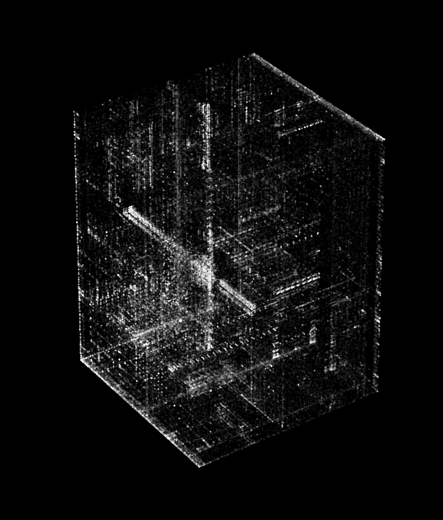

# IntoTheHex

|  |  |

IntoTheHex is a binary vizualisation personnal projet based on previous work from [Conti et al.](https://link.springer.com/chapter/10.1007/978-3-540-85933-8_1) and tool from [Christopher Domas](https://sites.google.com/site/xxcantorxdustxx/).
